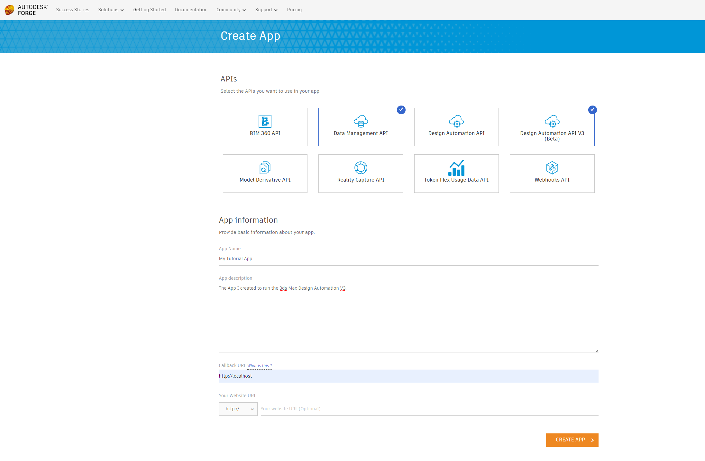
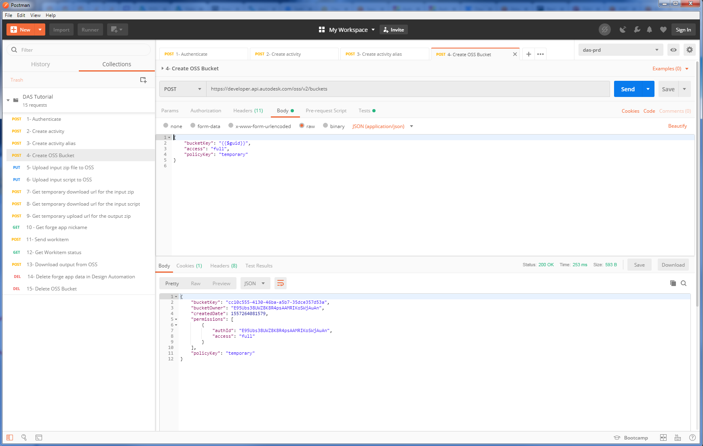
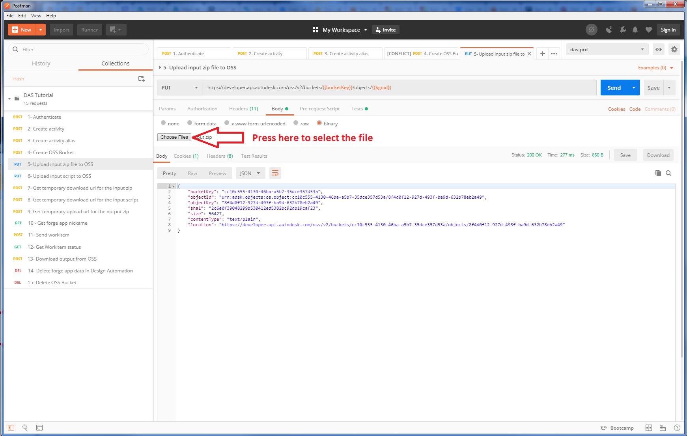
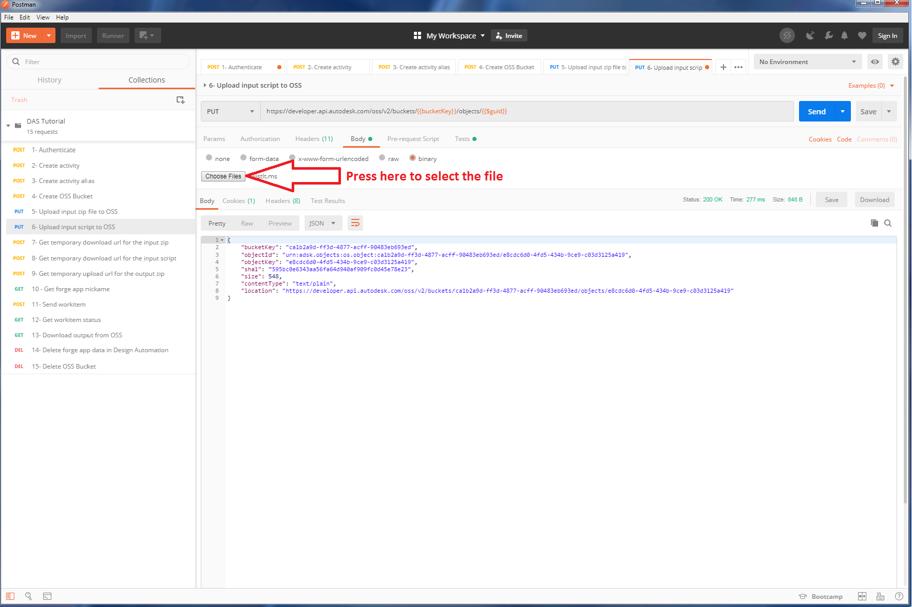
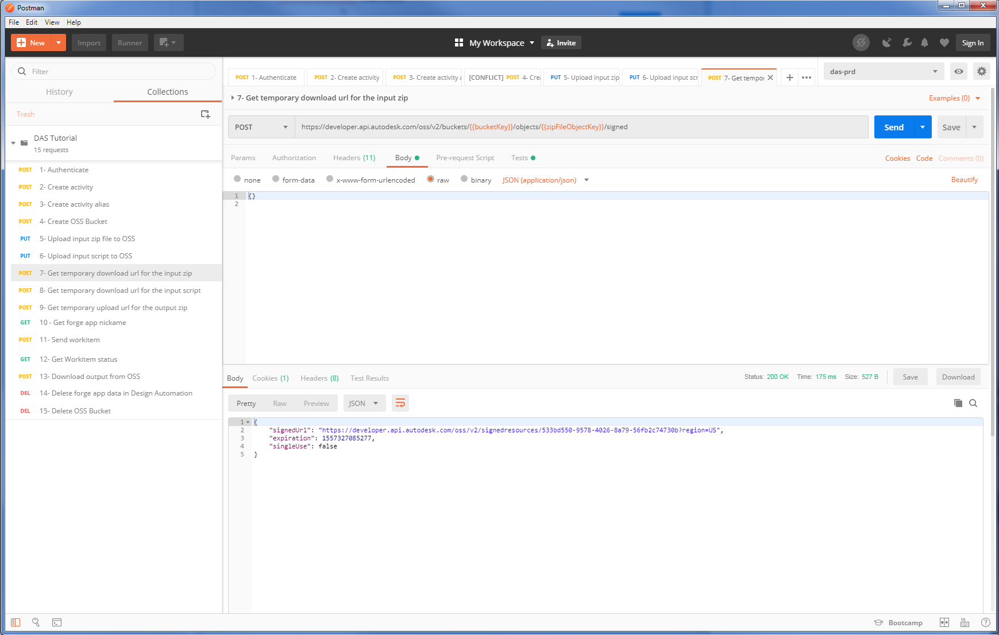
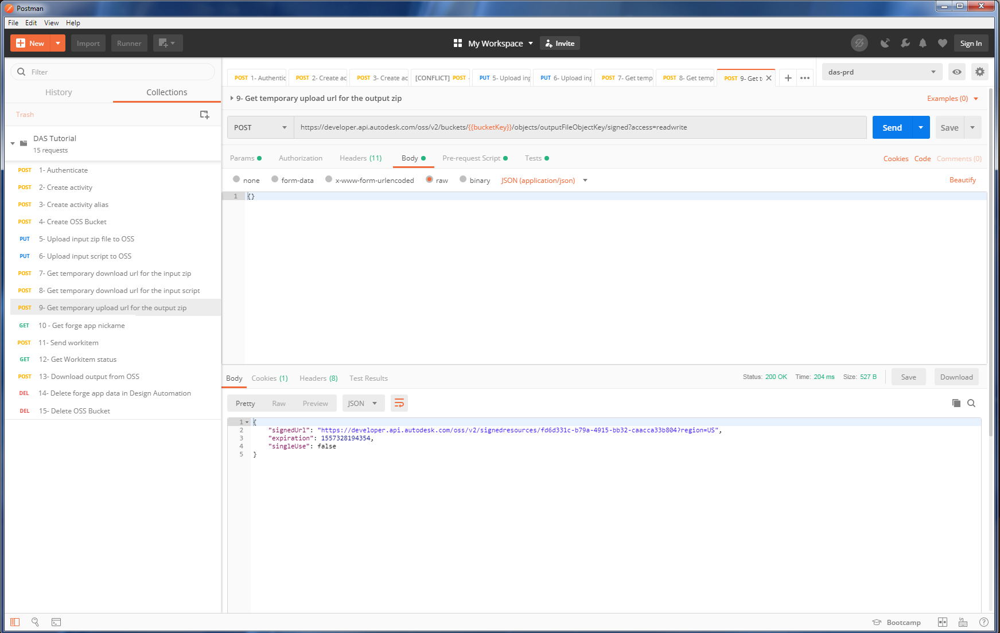
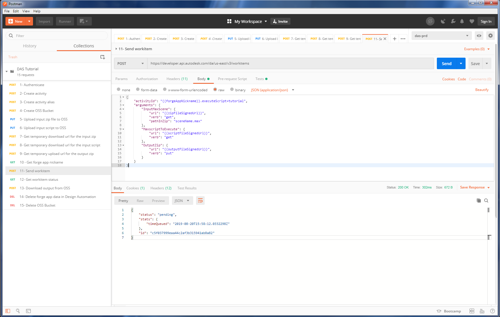
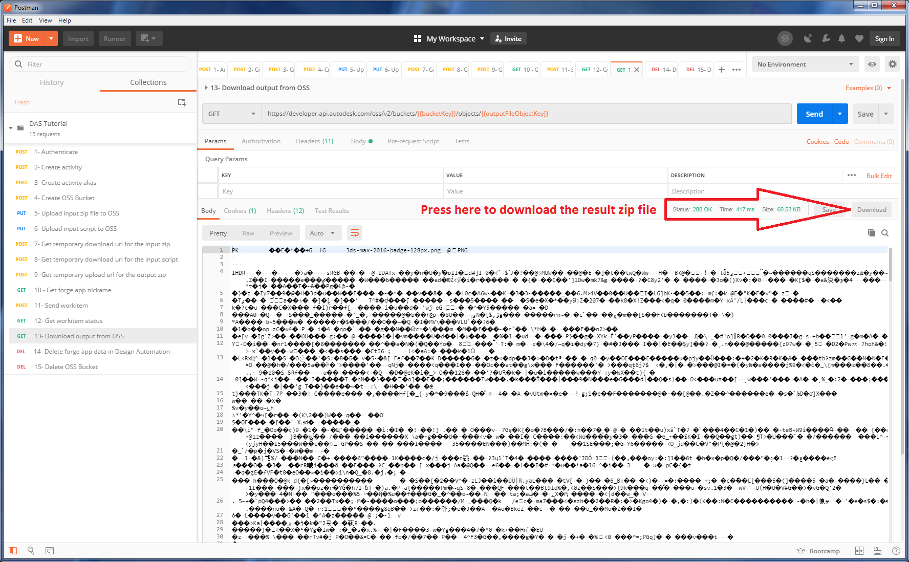

# FDA-postman-tutorial
Basic tutorial on how to run a 3ds Max script in Design Automation V3

## Getting help
Any question related to Design Automation can be posted on [stackoverflow](https://stackoverflow.com/questions/tagged/autodesk-designautomation).
Make sure to add the ```autodesk-designautomation``` tag to your question(s).

## Description
This tutorial will demonstrate how to use Design Automation V3 to automate the execution of a script on a 3ds Max scene using postman.
You can use your own script and max scene or the [samples](samples) provided.

The postman collection for this tutorial contains only the requests necessary for the tutorial.
A more complete postman collection for the Design Automation V3 API can be found [here](https://forge.autodesk.com/en/docs/design-automation/v3/developers_guide/postman/) to further explore the API.  

## Forge and Postman setup
### Creating ForgeApp
Go to the forge website, create a new account if you don't have one and sign in.
```https://forge.autodesk.com/```

Once you are logged in, you will be able to create a new forge app. To do so, first mouse over the picture on the top right corner and select "My Apps" or press the "GO TO MY APPS" button


Once you reached the "My Apps" page, press the "CREATE APP" button.


Once you have reached the "Create App" page.  You will need to select the "Data Management API" the "Design Automation API V3" since these are the 2 APIs that will be required for this tutorial.
Fill the rest of the form and press the "CREATE APP" button.

Note that in certain contexts, your app needs to hand over part of the authentication flow to the Forge Platform. 
For example, in three-legged authentication for a web app, an end user of your app is redirected to an Autodesk login flow, so that the user can tell the platform that your app is authorized to act on the user’s behalf.
The callback URL is what is passed to the Autodesk login flow to tell it how to redirect the user back to your app.
However, the tutorial will not require any three-legged authentication so the Callback URL can be any valid url.



Once you have pressed the "CREATE APP" button, you should be presented with the App information which contains your app "Client ID" and "Client Secret".
Make sure to keep these value close since we will need them later in the tutorial.


### Postman Installation
Download and install postman from this url
```https://www.getpostman.com/downloads/```

### Postman Collection
Once postman is installed, launch the application and import the [DAS Tutorial.postman_collection.json](DAS%20Tutorial.postman_collection.json) by pressing the import button and selecting the collection file.


Once the collection is imported you should see it in the side bar to the left.


Expand the collection by clicking on the small triangle.  You should now see the 15 requests we will be doing during this tutorial.


Once you select a request in the side bar, you will see the details of the request appear on the right.
You can see the verb and url of the request in the top bar and different tabs that will let you browse the headers and body of the different request.


## Executing the tutorial
The tutorial will walk you through making 15 http requests using postman.  
Each request has a number associated with it that indicate the order in which they should be executed for this tutorial.
If you wish to restart the tutorial or cleanup what have been created during it, the request 14 and 15 are designed to delete everything stored in Design Automation for your forge APP and the storage that was created during the tutorial.
To send a request you will simply have to press the "Send" button in postman.  However, make sure to read the instructions below for each request before sending it since some request might require you to enter some information.


### 1- Authentication
[forge documentation](https://forge.autodesk.com/en/docs/oauth/v2/reference/http/authenticate-POST/)

This request to the Authentication API will obtain a token with the scope require for this tutorial.  
This token will be used by all the subsequent request inside the "Authorization" header to identify your forge app.
This token will expire after one hour so you might need to execute the request again to get a new token if your expire.

Before executing this request, you will need to enter the forge app client id and client secret that was obtained by following the "Creating ForgeApp" section of this readme.md inside the body of the request.
Once the request is completed, postman will save the access_token received in the body response inside a variable named "accessToken" to be reused in the subsequent requests.


### 2- Create Activity
[forge documentation](https://forge.autodesk.com/en/docs/design-automation/v3/reference/http/activities-POST/)

This request to the Design Automation V3 API will create an activity.
In the Design Automation API an activity specify an action that can be executed using a specified engine.
The request body contains the following fields.

##### id
The id of the activity to be created.  This should be unique for a given forge app.

##### commandLine 
This define the command line to be executed. You use variable that will be replaced before executing your command line.
This mechanism let you replace file path(s) value in command line that you tested locally with file path(s) that will make sense once the execution is launched in the Design Automation environment.

Here are some example of variables can be used:

```$(engine.path)``` 
will be replaced by the path where the engine is installed.

```$(args[myParam1].path)``` 
for a given parameter with the key "myParam1", this will be replaced by the file path where the file got uploaded/downloaded to.
If the parameter is a zip, it will be replaced by the path to the folder where the zip got unzipped.

```$(args[myStringParam].value)``` 
will be replaced by the string value provided at work item submission of the parameter with the key "myStringParam" (Only for argument using the "read" verb).

```$(appbundles[myAppBundle].path)``` 
will be replaced by the path where the "myAppBundle" app bundle have been unzipped.

```$(setting[settingX].path)``` 
will write to a file the value of the setting with "settingX" key and be replaced by the path to the file that was written.

```$(setting[settingX].value)``` 
will be replaced by the value of the setting with the "settingX" key.

##### engine
This define the processing engine to be installed on the machine that will execute the action. (Auto CAD, Inventor, Revit, 3ds Max)

##### parameters
These define the inputs and outputs that will need to be provided to execute the action defined.

###### InputZip
For this tutorial we define an input parameter that will be used to downloaded and unzipped a zip file inside a folder name "workingFolder".  This input zip will contain a max scene and all it dependencies.

###### MaxFileName
For this tutorial we define an input string parameter that will be used to provide the name of the 3ds Max file inside the zip file provided by the "InputZip" parameter

###### MaxscriptToExecute
For this tutorial we define an input parameter that will be used to downloaded a maxscript file that will be named maxscriptToExecute.ms once downloaded.

###### outputZip
For this tutorial we define an output parameter that will zip the sub-folder named "workingFolder" at the end of the execution and upload it.


### 3- Create Activity Alias
[forge documentation](https://forge.autodesk.com/en/docs/design-automation/v3/reference/http/activities-id-aliases-POST/)

When submitting an activity to be executed to the Design Automation API V3, we must reference it by it's alias (see request 13). 
An alias is like a tag that point to a particular version of an activity.
The version an alias point to can be changed in the future as develop more version of a given activity.
The request number 2 created the version 1 of our activity "executeScript".
This request will now create an alias named "tutorial" to reference version 1.


### 4- Create OSS bucket
[forge documentation](https://forge.autodesk.com/en/docs/data/v2/reference/http/buckets-POST/)

This request to the Data Management API will create a bucket in the object storage service (OSS) that we will use to store our input zip file, input script file and our resulting zip file.
The bucket will be created with a random guid and the key to this bucket will be saved inside the "bucketKey" variable for sub-sequent request.




### 5- Upload input zip file to OSS
[forge documentation](https://forge.autodesk.com/en/docs/data/v2/reference/http/buckets-:bucketKey-objects-:objectName-PUT/)

This request to the Data Management API will upload the input zip file containing the 3ds Max file to the object storage service (OSS).
Before sending the request you will need to select the file to be uploaded by pressing the "Choose files" button in the Body tab.
If you wish to use the [samples](samples) provided in the tutorial, select the [input.zip](samples/input.zip) file.
Once the request is done, the "objectKey" value from the response body will be automatically saved into a variable named "zipFileObjectKey" that will be used in sub-sequent requests.



### 6- Upload input script to OSS
[forge documentation](https://forge.autodesk.com/en/docs/data/v2/reference/http/buckets-:bucketKey-objects-:objectName-PUT/)

This request to the Data Management API will upload the input script file to the object storage service (OSS).
Before sending the request you will need to select the file to be uploaded by pressing the "Choose files" button in the Body tab.
If you wish to use the [samples](samples) provided in the tutorial, select the [TwistIt.ms](samples/TwistIt.ms) file.
This script will simply apply the twist modifier to your entire scene and create an animation from frame 0 to 100.
Once the request is done, the "objectKey" value from the response body will be automatically saved into a variable named "scriptFileObjectKey" that will be used in sub-sequent requests.




### 7- Get temporary download url for the input zip
[forge documentation](https://forge.autodesk.com/en/docs/data/v2/reference/http/buckets-:bucketKey-objects-:objectName-signed-POST/)

This request to the Data Management API will create a temporary download url for the input zip file we uploaded to the Object Storage Service during request 5.
We will provide this url to the Design Automation V3 API during request 11 when we send our work item to be executed.
The Design Automation API will use this url to download our zip file before executing the command line we defined inside our activity during request 2.
Once the request is done, the "signedUrl" value from the response body will be automatically saved into a variable named "zipFileSignedUrl" that will be used in sub-sequent requests.



### 8- Get temporary download url for input script
[forge documentation](https://forge.autodesk.com/en/docs/data/v2/reference/http/buckets-:bucketKey-objects-:objectName-signed-POST/)

This request to the Data Management API will create a temporary download url for the script file we uploaded to the Object Storage Service during request 6.
We will provide this url to the Design Automation V3 API during request 11 when we send our work item to be executed.
The Design Automation API will use this url to download our script file before executing the command line we defined inside our activity during request 2.
Once the request is done, the "signedUrl" value from the response body will be automatically saved into a variable named "scriptFileSignedUrl" that will be used in sub-sequent requests.


 
 
 ### 9- Get temporary upload url for the output script
 [forge documentation](https://forge.autodesk.com/en/docs/data/v2/reference/http/buckets-:bucketKey-objects-:objectName-signed-POST/)
 
 This request to the Data Management API will create a temporary upload url to a new object in the Object Storage Service.
 We will provide this url to the Design Automation V3 API during request 11 when we send our work item to be executed.
 The Design Automation API will use this url to upload the resulting zip file after executing the command line we defined inside our activity during request 2.
 Once the request is done, the "signedUrl" value from the response body will be automatically saved into a variable named "outputFileSignedUrl" that will be used in sub-sequent requests.
 

  
  
### 10- Get forge app nickname
[forge documentation](https://forge.autodesk.com/en/docs/design-automation/v3/reference/http/forgeapps-id-GET/)

This request to the Design Automation V3 will request your forge app nickname from the Design Automation API.
By default this value will always be your forge app client id.  We will use this value to reference the activity and alias we created for it during request 11.
Once the request is done, the body the response body value will be saved automatically inside a variable named "forgeAppNickname".
 

 
 
### 11- Send work item
[forge documentation](https://forge.autodesk.com/en/docs/design-automation/v3/reference/http/workitems-POST/)

This request to the Design Automation V3 API will launch the execution of the activity that was created during the request number 2.
Once the request is done, the id of the work item will be automatically extracted from the body response and saved inside a variable name "workitemId" for sub-sequent requests.
The body of the request contains the following fields.
 
##### activityId
This id identify the activity that we want to execute. The id that refer to the activity alias that was created during request number 3.  
The id is made of 3 parts, first the forge app nickname followed by the '.' character followed by the activity name followed by the '+' character and finally the alias id.
 
##### arguments
This section contains all the arguments that need to be passed to the activity selected by the activityId.  
These need to match one for one what we defined as parameters in our activity during request number 2.
 
###### MaxFileName
This argument provide the name of the 3ds Max file inside InputZip to load before running the script.
You should change this value to reflect what is inside you inputZip if you are not using the [samples](samples).

###### InputZip
This argument provide the signed url we created during request number 7.  This url will be used to download the input zip file.
 
###### MaxscriptToExecute
This argument provide the signed url we created during request number 8.  This url will be used to download the input script file.
 
###### OutputZip
This argument provide the signed url we created during request number 9.  This url will be used to upload a zip file with the content of the "workingFolder" sub-folder at the end of the execution of the work item.




### 12- Get workitem status
[forge documentation](https://forge.autodesk.com/en/docs/design-automation/v3/reference/http/workitems-id-GET/)

This request to the Design Automation API V3 will query the status of the work item.
We can use this request to determine when the work item is done executing.
However, it is important to note that you can also define an url to be called once the work item is done instead of polling the status from this url.
This can be done inside the request that submit the work item but this is outside of the scope of this tutorial. (TODO add documentation link)
The request should be repeated until the status value inside the body pass from "pending" to "inprogress" to "success".
Once you reached the "success" status it means that your work item has finished executing.
You can use "reportUrl" value to download the log file of your work item execution if you wish to take a look.


### 13- Download output from OSS
[forge documentation](https://forge.autodesk.com/en/docs/data/v2/reference/http/buckets-:bucketKey-objects-:objectName-GET/)

This request to the Data Management API will let you download the result zip file that have been uploaded by Design Automation to the Object Storage Service (OSS).
To save the result back to disk locally, press the download button once the response have been received.




### 14- Delete forge app data from Design Automation
[forge documentation](https://forge.autodesk.com/en/docs/design-automation/v3/reference/http/forgeapps-id-DELETE/)

This request to the Design Automation V3 API will delete everything owned by your forge app inside the Design Automation V3 API.
Be really cautious when using this request if you are using a forge app that already have useful data inside the Design Automation V3 API.


### 15- Delete OSS bucket

This request to the Data Management API will delete the bucket that was created by request number 4 and every file that it contains.


